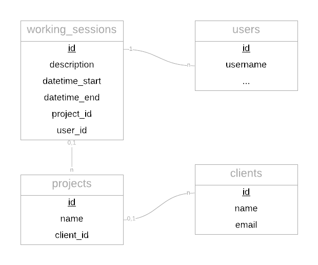
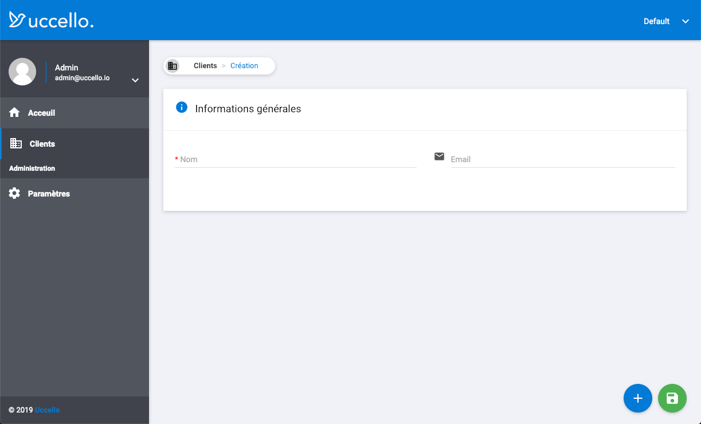
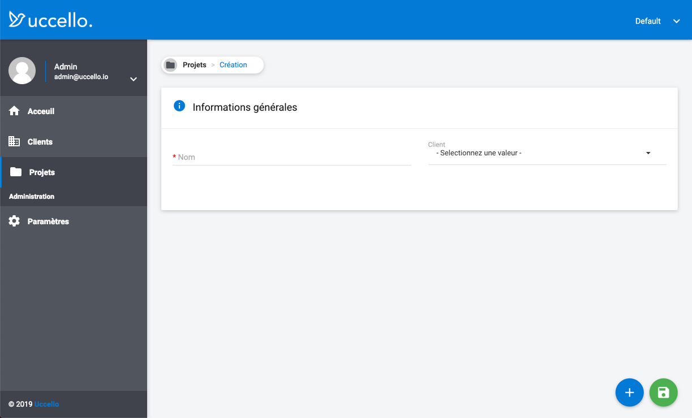
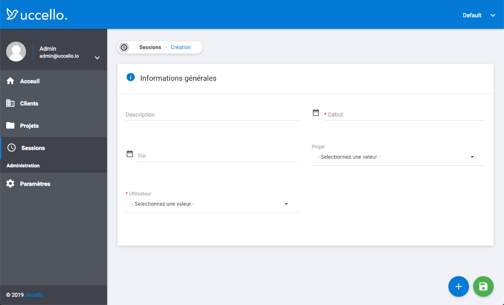

# Tutoriel - Gestion du temps de travail

Nous allons voir dans ce tutoriel comment créer un outil de **gestion du temps de travail** comme ce que propose [Clockify](https://clockify.me).

Nous commencerons par créer un nouveau projet Uccello, puis nous créerons la **structure** des modules avant de personnaliser l'interface pour la rendre **intuitive** et **simple** d'utilisation.

## Étape 1 - Créer le projet

> Pour avoir plus d'informations concernant l'installation, vous pouvez lire l'article [Installer Uccello](../installation/installation-methods.md).

Nous allons tout d'abord créer un nouveau projet Uccello vierge. Pour cela ouvrez la console, aller dans le répertoire dans lequel vous voulez installer le projet et exécutez la commande suivante :

```bash
$ composer create-project --prefer-dist uccello/project clockify
```

Si vous souhaitez utiliser Uccello en français, penser à modifier le paramètre `locale` du fichier `config/app.php` :

```php
...
'locale' => 'fr',
...
```

Après avoir configuré la base de données dans le fichier `.env`, exécutez la commande suivante :

```bash
$ php artisan migrate
```

> Pour ce tutoriel j'ai choisi l'URL http://clockify.local. Vous pouvez bien entendu choisir l'URL de votre choix.

Votre projet est maintenant prêt. Vous pouvez vous rendre à l'URL http://clockify.local et vous authentifier avec les identifiants suivants :

```
Identifiant : admin
Mot de passe : admin
```

## Étape 2 - Créer les modules

### Structure des modules

Voici la structure des modules nécessaires pour stocker les sessions de travail.



Une **Session de travail** est caractérisée par :

- Une description
- Une date et heure de début
- Une date et heure de fin
- Un projet
- Un utilisateur (celui authentifié)


Un **Projet** est caractérisé par :

- Un nom
- Un client


Un **Client** est caractérisé par :

- Un nom
- Un email


### Générer les modules

On va utiliser le package [uccello/module-designer](https://github.com/uccellolabs/uccello-module-designer) pour nous assister dans la création des modules.

Exécutez les commandes suivantes dans la console pour installer **Module Designer** :

```bash
$ composer require uccello/module-designer
$ php artisan migrate
```

#### Module Client

Nous allons créer le module **Client** grâce à Module Designer :

> **Rappel :** Appuyez sur la touche <kbd>⮐ ENTRÉE</kbd> afin d'utiliser les valeurs par défaut proposées par Uccello.

```bash
$ php artisan make:module

Select an action to perform:
  [0] Create a new module
  [1] Edit a module
 > 0
 
 What is the module name? (e.g. book-type):
 > client

 Translation plural [fr]:
 > Clients

 Translation single [fr]:
 > Client

 Model class [App\Client]:
 >

 Table name [clients]:
 >

 Table prefix []:
 >

 Material icon name (See https://material.io/tools/icons):
 > domain

 Is this module for administration panel? (yes/no) [no]:
 >

 Default route [uccello.list]:
 >

+--------+---------+------------+---------+--------+--------+-----------+---------------+
| Name   | Package | Model      | Table   | Prefix | Icon   | For admin | Default route |
+--------+---------+------------+---------+--------+--------+-----------+---------------+
| client |         | App\Client | clients |        | domain | No        | uccello.list  |
+--------+---------+------------+---------+--------+--------+-----------+---------------+

 Is this information correct? (yes/no) [yes]:
 >
```

**Ajoutons un onglet** :

```bash
What action do you want to perform? [Add a tab]:
  [1] Add a tab
  [2] Add a block
  [3] Add a field
  [4] Add a related list
  [5] Add a link
  [6] Delete an element
  [7] Install module
  [8] Make migration
  [9] Exit
 > 1

 Tab label (will be translated) [tab.main]:
 >

 Translation [fr]:
 > Détails

 Icon CSS class name (See https://material.io/tools/icons):
 >
```

**Ajoutons un bloc :**

```bash
What action do you want to perform? [Add a block]:
  [1] Add a tab
  [2] Add a block
  [3] Add a field
  [4] Add a related list
  [5] Add a link
  [6] Delete an element
  [7] Install module
  [8] Make migration
  [9] Exit
 > 2

 Choose the tab [tab.main]:
  [0] tab.main
 >

 Block label (will be translated) [general]:
 >

 Translation [fr]:
 > Informations générales

 Do you want to add a description? (yes/no) [no]:
 >

 Icon CSS class name (See https://material.io/tools/icons):
 > info
```

**Ajoutons le champ Nom :**

```bash
What action do you want to perform? [Add a field]:
  [1] Add a tab
  [2] Add a block
  [3] Add a field
  [4] Add a related list
  [5] Add a link
  [6] Delete an element
  [7] Install module
  [8] Make migration
  [9] Exit
 > 3

 Choose the block in which to add the field [block.general]:
  [0] block.general
 >

 Field name:
 > name

 Translation [fr]:
 > Nom

 Choose an uitype [text]:
  [0 ] boolean
  [1 ] checkbox
  [2 ] choice
  [3 ] color
  [4 ] date
  [5 ] datetime
  [6 ] email
  [7 ] entity
  [8 ] file
  [9 ] hidden
  [10] image
  [11] integer
  [12] month
  [13] number
  [14] password
  [15] phone
  [16] range
  [17] search
  [18] select
  [19] text
  [20] textarea
  [21] time
  [22] url
  [23] week
 > text

 Choose a display type [everywhere]:
  [0] everywhere
  [1] create
  [2] detail
  [3] edit_detail
  [4] hidden
 >

 Is the field required? (yes/no) [no]:
 > yes

 Display this field by default in the list view? (yes/no) [yes]:
 >

 Display the field in two columns? (yes/no) [no]:
 >

 Default value:
 >

 Do you want to add an information text? (yes/no) [no]:
 >

 Other rules (See https://laravel.com/docs/5.7/validation#available-validation-rules):
 >

 Would you like to repeat this field (for confirmation)? (yes/no) [no]:
 >
```

**Ajoutons le champ Email :**

```bash
 What action do you want to perform? [Add a field]:
  [1] Add a tab
  [2] Add a block
  [3] Add a field
  [4] Add a related list
  [5] Add a link
  [6] Delete an element
  [7] Install module
  [8] Make migration
  [9] Exit
 > 3

 Choose the block in which to add the field [block.general]:
  [0] block.general
 >

 Field name:
 > email

 Translation [fr]:
 > Email

 Choose an uitype [text]:
  [0 ] boolean
  [1 ] checkbox
  [2 ] choice
  [3 ] color
  [4 ] date
  [5 ] datetime
  [6 ] email
  [7 ] entity
  [8 ] file
  [9 ] hidden
  [10] image
  [11] integer
  [12] month
  [13] number
  [14] password
  [15] phone
  [16] range
  [17] search
  [18] select
  [19] text
  [20] textarea
  [21] time
  [22] url
  [23] week
 > email

 Choose a display type [everywhere]:
  [0] everywhere
  [1] create
  [2] detail
  [3] edit_detail
  [4] hidden
 >

 Is the field required? (yes/no) [no]:
 >

 Display this field by default in the list view? (yes/no) [yes]:
 >

 Display the field in two columns? (yes/no) [no]:
 >

 Default value:
 >

 Do you want to add an information text? (yes/no) [no]:
 >

 Other rules (See https://laravel.com/docs/5.7/validation#available-validation-rules):
 >

 Would you like to repeat this field (for confirmation)? (yes/no) [no]:
 >

 Where do you want to add this field? [After - name]:
  [0] Before - name
  [1] After - name
 >
```

**Générons le fichier de migration :**

```bash
What action do you want to perform? [Add a field]:
  [1] Add a tab
  [2] Add a block
  [3] Add a field
  [4] Add a related list
  [5] Add a link
  [6] Delete an element
  [7] Install module
  [8] Make migration
  [9] Exit
 > Make migration

The file database/migrations/2019_01_25_142434_create_client_module.php was created.
```

Grâce au fichier de migration, il sera possible dé **réinstaller facilement** le module à l'avenir, que ce soit sur le serveur de développement et sur celui de production.

**Installons le module :**

```
What action do you want to perform?:
  [1] Add a tab
  [2] Add a block
  [3] Add a field
  [4] Add a related list
  [5] Add a link
  [6] Delete an element
  [7] Install module
  [8] Make migration
  [9] Exit
 > 7

The module client was created.
The table clients was created.
The file resources/lang/fr/client.php was created.
The file app/Client.php was created.
```

Cette action va exécuter les actions suivantes :

- Ajouter le module dans la table `uccello_modules`
- Créer la table `clients` dans la base de données
- Créer le fichier de tradution `resources/lang/fr/client.php`
- Créer le modèle `app/Client.php`

Une fois le module installé, si nous allons dans notre projet Uccello, le module Client est **prêt à être utilisé**.



#### Module Projet

De la même manière, nous allons créer le module **Projet**.

```bash
$ php artisan make:module

Select an action to perform:
  [0] Create a new module
  [1] Edit a module
 > 0

# Module
What is the module name? (e.g. book-type):
 > project

 Translation plural [fr]:
 > Projets

 Translation single [fr]:
 > Projet

 Model class [App\Project]:
 >

 Table name [projects]:
 >

 Table prefix []:
 >

 Material icon name (See https://material.io/tools/icons):
 > folder

 Is this module for administration panel? (yes/no) [no]:
 >

 Default route [uccello.list]:
 >

+---------+---------+-------------+----------+--------+--------+-----------+---------------+
| Name    | Package | Model       | Table    | Prefix | Icon   | For admin | Default route |
+---------+---------+-------------+----------+--------+--------+-----------+---------------+
| project |         | App\Project | projects |        | folder | No        | uccello.list |
+---------+---------+-------------+----------+--------+--------+-----------+---------------+

 Is this information correct? (yes/no) [yes]:
 >

 # Onglet
 What action do you want to perform? [Add a tab]:
  [1] Add a tab
  [2] Add a block
  [3] Add a field
  [4] Add a related list
  [5] Add a link
  [6] Delete an element
  [7] Install module
  [8] Make migration
  [9] Exit
 > 1

 Tab label (will be translated) [tab.main]:
 >

 Translation [fr]:
 > Détails

 Icon CSS class name (See https://material.io/tools/icons):
 >

 # Bloc
 What action do you want to perform? [Add a block]:
  [1] Add a tab
  [2] Add a block
  [3] Add a field
  [4] Add a related list
  [5] Add a link
  [6] Delete an element
  [7] Install module
  [8] Make migration
  [9] Exit
 > 2

 Choose the tab [tab.main]:
  [0] tab.main
 >

 Block label (will be translated) [general]:
 >

 Translation [fr]:
 > Informations générales

 Do you want to add a description? (yes/no) [no]:
 >

 Icon CSS class name (See https://material.io/tools/icons):
 > info

 # Champ Nom
 What action do you want to perform? [Add a field]:
  [1] Add a tab
  [2] Add a block
  [3] Add a field
  [4] Add a related list
  [5] Add a link
  [6] Delete an element
  [7] Install module
  [8] Make migration
  [9] Exit
 > 3

 Choose the block in which to add the field [block.general]:
  [0] block.general
 >

 Field name:
 > name

 Translation [fr]:
 > Nom

 Choose an uitype [text]:
  [0 ] boolean
  [1 ] checkbox
  [2 ] choice
  [3 ] color
  [4 ] date
  [5 ] datetime
  [6 ] email
  [7 ] entity
  [8 ] file
  [9 ] hidden
  [10] image
  [11] integer
  [12] month
  [13] number
  [14] password
  [15] phone
  [16] range
  [17] search
  [18] select
  [19] text
  [20] textarea
  [21] time
  [22] url
  [23] week
 > text

 Choose a display type [everywhere]:
  [0] everywhere
  [1] create
  [2] detail
  [3] edit_detail
  [4] hidden
 >

 Is the field required? (yes/no) [no]:
 > yes

 Display this field by default in the list view? (yes/no) [yes]:
 >

 Display the field in two columns? (yes/no) [no]:
 >

 Default value:
 >

 Do you want to add an information text? (yes/no) [no]:
 >

 Other rules (See https://laravel.com/docs/5.7/validation#available-validation-rules):
 >

 Would you like to repeat this field (for confirmation)? (yes/no) [no]:
 >

 # Champ Client
 What action do you want to perform? [Add a field]:
  [1] Add a tab
  [2] Add a block
  [3] Add a field
  [4] Add a related list
  [5] Add a link
  [6] Delete an element
  [7] Install module
  [8] Make migration
  [9] Exit
 > 3

 Choose the block in which to add the field [block.general]:
  [0] block.general
 >

 Field name:
 > client

 Translation [fr]:
 > Client

 Choose an uitype [text]:
  [0 ] boolean
  [1 ] checkbox
  [2 ] choice
  [3 ] color
  [4 ] date
  [5 ] datetime
  [6 ] email
  [7 ] entity
  [8 ] file
  [9 ] hidden
  [10] image
  [11] integer
  [12] month
  [13] number
  [14] password
  [15] phone
  [16] range
  [17] search
  [18] select
  [19] text
  [20] textarea
  [21] time
  [22] url
  [23] week
 > entity

 Choose a display type [everywhere]:
  [0] everywhere
  [1] create
  [2] detail
  [3] edit_detail
  [4] hidden
 >

 Is the field required? (yes/no) [no]:
 >

 Display this field by default in the list view? (yes/no) [yes]:
 >

 Display the field in two columns? (yes/no) [no]:
 >

 Default value:
 >

 Do you want to add an information text? (yes/no) [no]:
 >

 Other rules (See https://laravel.com/docs/5.7/validation#available-validation-rules):
 >

 What is the related module:
  [0] client
  [1] domain
  [2] home
  [3] module-designer
  [4] profile
  [5] project
  [6] role
  [7] settings
  [8] user
 > client

 Where do you want to add this field? [After - name]:
  [0] Before - name
  [1] After - name
 >

 # Migration
 What action do you want to perform? [Add a field]:
  [1] Add a tab
  [2] Add a block
  [3] Add a field
  [4] Add a related list
  [5] Add a link
  [6] Delete an element
  [7] Install module
  [8] Make migration
  [9] Exit
 > 8

The file database/migrations/2019_01_25_145057_create_project_module.php was created.

 # Installation
 What action do you want to perform?:
  [1] Add a tab
  [2] Add a block
  [3] Add a field
  [4] Add a related list
  [5] Add a link
  [6] Delete an element
  [7] Install module
  [8] Make migration
  [9] Exit
 > Install module

The module project was created.
The table projects was created.
The file resources/lang/fr/project.php was created.
The file app/Project.php was created.
```



#### Module Session de travail

```bash
$ php artisan make:module

 Select an action to perform:
  [0] Create a new module
  [1] Edit a module
 > 0

 # Module
 What is the module name? (e.g. book-type):
 > working-session

 Translation plural [fr]:
 > Sessions

 Translation single [fr]:
 > Session

 Model class [App\WorkingSession]:
 >

 Table name [working-sessions]:
 >

 Table prefix []:
 >

 Material icon name (See https://material.io/tools/icons):
 > access_time

 Is this module for administration panel? (yes/no) [no]:
 >

 Default route [uccello.list]:
 >

+-----------------+---------+--------------------+------------------+--------+-------------+-----------+---------------+
| Name            | Package | Model              | Table            | Prefix | Icon        | For admin | Default route |
+-----------------+---------+--------------------+------------------+--------+-------------+-----------+---------------+
| working-session |         | App\WorkingSession | working-sessions |        | access_time | No        | uccello.list  |
+-----------------+---------+--------------------+------------------+--------+-------------+-----------+---------------+

 Is this information correct? (yes/no) [yes]:
 >

 # Onglet
 What action do you want to perform? [Add a tab]:
  [1] Add a tab
  [2] Add a block
  [3] Add a field
  [4] Add a related list
  [5] Add a link
  [6] Delete an element
  [7] Install module
  [8] Make migration
  [9] Exit
 > 1

 Tab label (will be translated) [tab.main]:
 >

 Translation [fr]:
 > Détails

 Icon CSS class name (See https://material.io/tools/icons):
 >

 # Bloc
 What action do you want to perform? [Add a block]:
  [1] Add a tab
  [2] Add a block
  [3] Add a field
  [4] Add a related list
  [5] Add a link
  [6] Delete an element
  [7] Install module
  [8] Make migration
  [9] Exit
 > 2

 Choose the tab [tab.main]:
  [0] tab.main
 >

 Block label (will be translated) [general]:
 >

 Translation [fr]:
 > Informations générales

 Do you want to add a description? (yes/no) [no]:
 >

 Icon CSS class name (See https://material.io/tools/icons):
 > info

 # Champ description
 What action do you want to perform? [Add a field]:
  [1] Add a tab
  [2] Add a block
  [3] Add a field
  [4] Add a related list
  [5] Add a link
  [6] Delete an element
  [7] Install module
  [8] Make migration
  [9] Exit
 > 3

 Choose the block in which to add the field [block.general]:
  [0] block.general
 >

 Field name:
 > description

 Translation [fr]:
 > Description

 Choose an uitype [text]:
  [0 ] boolean
  [1 ] checkbox
  [2 ] choice
  [3 ] color
  [4 ] date
  [5 ] datetime
  [6 ] email
  [7 ] entity
  [8 ] file
  [9 ] hidden
  [10] image
  [11] integer
  [12] month
  [13] number
  [14] password
  [15] phone
  [16] range
  [17] search
  [18] select
  [19] text
  [20] textarea
  [21] time
  [22] url
  [23] week
 > text

 Choose a display type [everywhere]:
  [0] everywhere
  [1] create
  [2] detail
  [3] edit_detail
  [4] hidden
 >

 Is the field required? (yes/no) [no]:
 >

 Display this field by default in the list view? (yes/no) [yes]:
 >

 Display the field in two columns? (yes/no) [no]:
 >

 Default value:
 >

 Do you want to add an information text? (yes/no) [no]:
 >

 Other rules (See https://laravel.com/docs/5.7/validation#available-validation-rules):
 >

 Would you like to repeat this field (for confirmation)? (yes/no) [no]:
 >

 # Champ Début
 What action do you want to perform? [Add a field]:
  [1] Add a tab
  [2] Add a block
  [3] Add a field
  [4] Add a related list
  [5] Add a link
  [6] Delete an element
  [7] Install module
  [8] Make migration
  [9] Exit
 > 3

 Choose the block in which to add the field [block.general]:
  [0] block.general
 >

 Field name:
 > datetime_start

 Translation [fr]:
 > Début

 Choose an uitype [text]:
  [0 ] boolean
  [1 ] checkbox
  [2 ] choice
  [3 ] color
  [4 ] date
  [5 ] datetime
  [6 ] email
  [7 ] entity
  [8 ] file
  [9 ] hidden
  [10] image
  [11] integer
  [12] month
  [13] number
  [14] password
  [15] phone
  [16] range
  [17] search
  [18] select
  [19] text
  [20] textarea
  [21] time
  [22] url
  [23] week
 > datetime

 Choose a display type [everywhere]:
  [0] everywhere
  [1] create
  [2] detail
  [3] edit_detail
  [4] hidden
 >

 Is the field required? (yes/no) [no]:
 > yes

 Display this field by default in the list view? (yes/no) [yes]:
 >

 Display the field in two columns? (yes/no) [no]:
 >

 Default value:
 >

 Do you want to add an information text? (yes/no) [no]:
 >

 Other rules (See https://laravel.com/docs/5.7/validation#available-validation-rules):
 >

 Would you like to repeat this field (for confirmation)? (yes/no) [no]:
 >

 Where do you want to add this field? [After - description]:
  [0] Before - description
  [1] After - description
 >

 # Champ Fin
 What action do you want to perform? [Add a field]:
  [1] Add a tab
  [2] Add a block
  [3] Add a field
  [4] Add a related list
  [5] Add a link
  [6] Delete an element
  [7] Install module
  [8] Make migration
  [9] Exit
 > 3

 Choose the block in which to add the field [block.general]:
  [0] block.general
 >

 Field name:
 > datetime_end

 Translation [fr]:
 > Fin

 Choose an uitype [text]:
  [0 ] boolean
  [1 ] checkbox
  [2 ] choice
  [3 ] color
  [4 ] date
  [5 ] datetime
  [6 ] email
  [7 ] entity
  [8 ] file
  [9 ] hidden
  [10] image
  [11] integer
  [12] month
  [13] number
  [14] password
  [15] phone
  [16] range
  [17] search
  [18] select
  [19] text
  [20] textarea
  [21] time
  [22] url
  [23] week
 > datetime

 Choose a display type [everywhere]:
  [0] everywhere
  [1] create
  [2] detail
  [3] edit_detail
  [4] hidden
 >

 Is the field required? (yes/no) [no]:
 >

 Display this field by default in the list view? (yes/no) [yes]:
 >

 Display the field in two columns? (yes/no) [no]:
 >

 Default value:
 >

 Do you want to add an information text? (yes/no) [no]:
 >

 Other rules (See https://laravel.com/docs/5.7/validation#available-validation-rules):
 >

 Would you like to repeat this field (for confirmation)? (yes/no) [no]:
 >

 Where do you want to add this field? [After - datetime_start]:
  [0] Before - description
  [1] After - description
  [2] Before - datetime_start
  [3] After - datetime_start
 >

 # Champ Projet
 What action do you want to perform? [Add a field]:
  [1] Add a tab
  [2] Add a block
  [3] Add a field
  [4] Add a related list
  [5] Add a link
  [6] Delete an element
  [7] Install module
  [8] Make migration
  [9] Exit
 > 3

 Choose the block in which to add the field [block.general]:
  [0] block.general
 >

 Field name:
 > project

 Translation [fr]:
 > Projet

 Choose an uitype [text]:
  [0 ] boolean
  [1 ] checkbox
  [2 ] choice
  [3 ] color
  [4 ] date
  [5 ] datetime
  [6 ] email
  [7 ] entity
  [8 ] file
  [9 ] hidden
  [10] image
  [11] integer
  [12] month
  [13] number
  [14] password
  [15] phone
  [16] range
  [17] search
  [18] select
  [19] text
  [20] textarea
  [21] time
  [22] url
  [23] week
 > entity

 Choose a display type [everywhere]:
  [0] everywhere
  [1] create
  [2] detail
  [3] edit_detail
  [4] hidden
 >

 Is the field required? (yes/no) [no]:
 >

 Display this field by default in the list view? (yes/no) [yes]:
 >

 Display the field in two columns? (yes/no) [no]:
 >

 Default value:
 >

 Do you want to add an information text? (yes/no) [no]:
 >

 Other rules (See https://laravel.com/docs/5.7/validation#available-validation-rules):
 >

 What is the related module:
  [0] client
  [1] domain
  [2] home
  [3] module-designer
  [4] profile
  [5] project
  [6] role
  [7] settings
  [8] user
  [9] working-session
 > project

 Where do you want to add this field? [After - datetime_end]:
  [0] Before - description
  [1] After - description
  [2] Before - datetime_start
  [3] After - datetime_start
  [4] Before - datetime_end
  [5] After - datetime_end
 >

 # Champ Utilisateur
 What action do you want to perform? [Add a field]:
  [1] Add a tab
  [2] Add a block
  [3] Add a field
  [4] Add a related list
  [5] Add a link
  [6] Delete an element
  [7] Install module
  [8] Make migration
  [9] Exit
 > 3

 Choose the block in which to add the field [block.general]:
  [0] block.general
 >

 Field name:
 > user

 Translation [fr]:
 > Utilisateur

 Choose an uitype [text]:
  [0 ] boolean
  [1 ] checkbox
  [2 ] choice
  [3 ] color
  [4 ] date
  [5 ] datetime
  [6 ] email
  [7 ] entity
  [8 ] file
  [9 ] hidden
  [10] image
  [11] integer
  [12] month
  [13] number
  [14] password
  [15] phone
  [16] range
  [17] search
  [18] select
  [19] text
  [20] textarea
  [21] time
  [22] url
  [23] week
 > entity

 Choose a display type [everywhere]:
  [0] everywhere
  [1] create
  [2] detail
  [3] edit_detail
  [4] hidden
 >

 Is the field required? (yes/no) [no]:
 > yes

 Display this field by default in the list view? (yes/no) [yes]:
 >

 Display the field in two columns? (yes/no) [no]:
 >

 Default value:
 >

 Do you want to add an information text? (yes/no) [no]:
 >

 Other rules (See https://laravel.com/docs/5.7/validation#available-validation-rules):
 >

 What is the related module:
  [0] client
  [1] domain
  [2] home
  [3] module-designer
  [4] profile
  [5] project
  [6] role
  [7] settings
  [8] user
  [9] working-session
 > user

 Where do you want to add this field? [After - project]:
  [0] Before - description
  [1] After - description
  [2] Before - datetime_start
  [3] After - datetime_start
  [4] Before - datetime_end
  [5] After - datetime_end
  [6] Before - project
  [7] After - project
 >

 # Migration
 What action do you want to perform? [Add a field]:
  [1] Add a tab
  [2] Add a block
  [3] Add a field
  [4] Add a related list
  [5] Add a link
  [6] Delete an element
  [7] Install module
  [8] Make migration
  [9] Exit
 > 8

The file database/migrations/2019_01_25_150153_create_working_session_module.php was created.

 # Installation
 What action do you want to perform?:
  [1] Add a tab
  [2] Add a block
  [3] Add a field
  [4] Add a related list
  [5] Add a link
  [6] Delete an element
  [7] Install module
  [8] Make migration
  [9] Exit
 > 7

The module working-session was created.
The table working-sessions was created.
The file resources/lang/fr/working-session.php was created.
The file app/WorkingSession.php was created.
```



## Étape 3 - Personnaliser l'interface

Même si notre outil est fonctionnel, on se rend bien compte que l'interface mériterait d'être **personnalisée** afin de permettre à l'utilisateur de lancer et arrêter un **chronomètre** au lieu de saisir des dates et heures manuellement.

Nous verrons comment faire cela dans [la suite du tutoriel](./custom-interface.md).